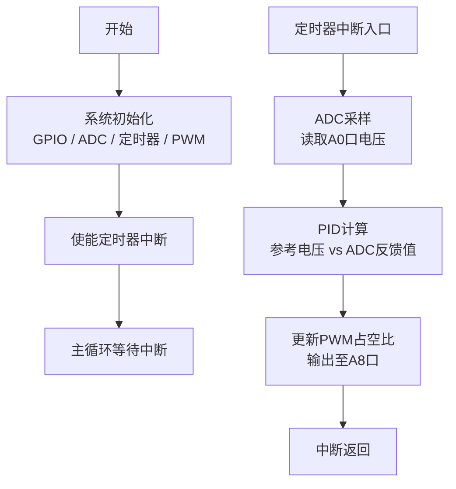

# 2026嵌入式系统课程设计

## 时间安排

地点：理学馆210

### 集合与选题

时间：2026-06-29 9:00

- 宣布课程设计要求与考核标准
- 分组选题，确定题目（三选一），每组不超过3人

### 提交计划书

时间：2026-06-30 9:00

各组提交《项目计划书》（本阶段为小组任务，每组提交一份），内容包括：

- **工作计划**：从选题到验收的详细时间节点，明确各阶段里程碑
- **时间安排**：组内成员的可投入时间与分工协调计划
- **物料采购计划**：列出所需全部物料清单（型号、数量、单价、采购渠道），预估总成本
- **分工方案**：明确每位成员的具体职责（硬件设计、软件开发、测试调试、文档撰写等）

### 设计文档提交与汇报

时间：2026-07-02 9:00

各组提交《系统设计文档》并分组汇报（本阶段为小组任务，每组提交一份），内容包括：

- **物料到位情况**：已到货物料清单与实物核对情况，未到货物料的预计到位时间
- **系统方案设计**：系统总体架构、硬件框图、软件流程图
- **详细设计文档**：
  - 硬件部分：电路原理图、关键元件参数计算、PCB布局规划（如有）
  - 软件部分：模块划分、关键算法描述、外设配置方案、任务调度设计（FreeRTOS任务划分等）
- **进度汇报**：当前完成情况与后续工作计划

### 中期检查

时间：2026-07-06 15:00

- 物料完备性检查：核对所有物料是否到位
- 进度检查：硬件搭建情况、软件调试进度
- 问题排查：识别当前瓶颈，给出解决方案建议

各组提交《中期检查报告》（本阶段为小组任务，每组提交一份），内容包括：

- 物料到位总览：已到位、未到位的物料明细
- 当前完成进度：已完成工作、进行中工作、未开始工作
- 硬件调试情况：各模块测试结果、遇到的问题与解决措施
- 软件调试情况：各功能模块开发进度、已通过的测试用例
- 存在的问题与风险：技术难点、物料延期等风险及应对方案
- 后续工作计划：至验收前的详细计划与分工调整（如有）

### 第一次验收

时间：2026-07-09 9:00

- 分组演示系统功能，现场测试
- 教师提出问题与修改意见
- 提交阶段性成果（功能演示视频、测试数据记录）

### 第二次验收

时间：2026-07-10 9:00

- 根据第一次验收意见进行改进后再次验收
- 最终评定成绩

### 个人总结报告

提交截止：验收后一周内

每位同学独立提交个人总结报告（每人一份），使用 LaTeX 模板撰写（模板参见 `课程报告LaTex模板/`），报告应包含以下章节：

| 章节 | 内容要求 |
| ---- | ---- |
| 项目简介 | 项目背景、主要功能概述 |
| 项目设计目标 | 设计目标与预期成果 |
| 项目设计与实现 | 硬件设计（系统架构、模块选型、电路原理图）、软件设计（软件架构、主程序流程、关键代码、技术实现细节） |
| 功能展示 | 功能描述、演示结果、测试数据与截图 |
| 物料与成本 | 物料清单（名称、数量、单价、用途）、项目总成本、损耗与损坏记录 |
| 个人贡献 | 报告撰写分工、个人编码工作内容、硬件连接工作、资本投入、开发中遇到的问题及解决方案 |
| 项目成果与反思 | 成果展示、项目评估（成功之处与不足）、个人反思与改进方向 |
| 附录 | 设计图纸、完整代码清单、参考文献 |

## 选题

从以下两类题目中选择一个来进行。STM32最小系统板共30块，第一类题目每组可领用一块；昇腾310B开发板共6块，最多支持6个小组进行昇腾310B题目开发。

### 第一类：纯STM32题目（STM32最小系统板 ×30）

#### 题目1：基于STM32的Buck电路的设计

##### 介绍

Buck电路作为一种降压电路，其核心功能在于将输入电压进行降低，以适应不同电压需求的用电设备。该电路主要依赖于晶体管、电感、电容和二极管等关键电子元件。电感在电路中起到了至关重要的作用，它不仅能够储存能量，还能提供电流。而二极管在此电路中的作用则是控制电流的方向。

Buck电路的工作模式有多种，包括连续电流模式（CCM）、不连续电流模式（DCM）以及边界模式（BCM）。这些模式的选择主要取决于具体的应用需求和电路设计。

此外，Buck电路还分为异步和同步两种类型。在异步Buck电路中，开关由MOS管、三极管或单刀双掷开关等电子元件担任。当开关闭合时，二极管不导通，电感左侧为输入电压，右侧为输出电压，实现降压。当开关断开时，电感的电流不发生突变，从左端流向右端；电压反向，左侧为低电势，右侧为高电势，同时，电感之前存储的磁能就转化为电能释放给负载。

Buck电路在实际应用中具有显著的优势。首先，它能够实现电压的降低，满足不同电压等级的用电设备的需求。其次，它可以实现输出电压的连续调节，使得输出电压能够平滑变化。再者，Buck电路具有较高的转换效率，有助于减少能量的损失。最后，Buck电路具有较宽的输入和输出电压范围，能够适应不同的应用场景。

##### 基本原理

Buck电路，又称降压电路，是一种基于电感储能原理的DC-DC变换器。通过控制占空比可变的PWM波切换开关管的导通和断开状态，将输入电源提供的直流电压转换为可调的低电压输出。

当PWM波为高电平时，开关管Q导通，储能电感L被充电，电流线性增加，同时对电容C充电并向负载提供能量，电感将电流转化为磁能并存储。当PWM波为低电平时，开关管Q关闭，电感通过续流二极管放电，电感电流线性减少，输出电压靠输出滤波电容C放电以及减小的电感电流维持。电容起到平滑输出电压的作用。

为了确保输出电压的稳定性，Buck电路通常采用负反馈控制。通过采样输出电压并反馈给微控制器，微控制器调节PWM波的占空比，使输出电压保持在预定范围内。Buck拓扑如下图所示：

  

##### 基本要求

- 完成Buck电路的设计
- 利用STM32控制Buck电路的输出电压
- 测试Buck电路的效率

##### 扩展要求

1. 增加旋转编码器与OLED显示，实现本地电压显示与手动调压
2. 增加蓝牙控制功能，实现电压的远程读取与调节，并设计蓝牙上位机
3. 完成PCB的设计，可使用最小系统板
4. 完成Buck电路的效率优化，实现最高效率达90%以上

##### 考核要求

| 等级 | 评定标准 |
| ---- | ---- |
| 优秀 | 完成全部基本要求与扩展要求1、2，以及3或4（PCB设计与效率优化二选一）；PCB布局布线合理（选3时）；Buck电路效率达90%以上（选4时）；OLED显示正常，旋转编码器调节流畅；蓝牙通信稳定，上位机界面美观、功能完整；设计文档详实，答辩表述清晰。 |
| 良好 | 完成全部基本要求与扩展要求1、2；OLED可正常显示，旋转编码器调节可用；蓝牙远程调节与上位机功能正常；设计文档完整，答辩表述较清晰。 |
| 中等 | 完成全部基本要求与至少一项扩展要求；Buck电路能稳定输出目标电压；设计文档基本完整，答辩能说明设计思路。 |
| 及格 | 完成基本要求；Buck电路可实现降压输出；设计文档包含关键内容，答辩能回答基本问题。 |

##### 设计步骤

1. **工作原理理解**：了解Buck电路拓扑结构的工作原理，分析Buck拓扑结构的特点、优缺点和适用场景。
2. **元件选择**：研究Buck电路所需的元件，如开关管、电感、电容等，了解元件选型方法、参数计算和特性要求。
3. **控制策略设计**：分析Buck电路的控制方式（电压模式/电流模式），设计电压环和电流环控制策略，选择适合的控制方案。
4. **电路参数计算和仿真**：计算电感、电容、电流和功率等关键参数，使用PSPICE或Simulink等工具进行电路仿真，验证设计正确性。
5. **实际制造与测试**：根据计算结果进行实际电路的制造与调试，测试效率，分析实验结果并对性能进行评估和优化。

##### DEMO参考

参考DEMO所用器件，其中电阻等未列出：

| 器件 | 参数 |
| ---- | ---- |
| 自举电容 | 470nF |
| 输出电容 | 470uF |
| 输入电容 | 470uF |
| 驱动芯片 | IR2103 |
| 控制芯片 | STM32F103C8T6最小系统板 |
| 功率电感 | 86uH |
| 二极管 | ES2AA-13-F |
| 负载 | 12V灯泡或风扇 |

原理图如下，其中A0、A8为STM32F103C8T6接口，其最小系统板未在原理图中画出。

DEMO原理图，其中VCC为15V：

  

STM32程序框图：

程序通过输出PWM波来控制Buck电路运行：对输出电压进行4:1分压后使用ADC（A0口）检测电压值，参考电压作为PID算法的参考输入，ADC输出值作为PID算法的反馈输入，PID算法据此得出相应的PWM占空比（A8口输出）控制电路。PID计算在定时器中断中完成。将输入VCC 15V降为OUT 12V。

实例原理图：

  

实测数据：

| 输入电压 | 输入电流 | 输入功率 | 输出电压 | 输出电流 | 输出功率 | 效率 | 负载阻值 |
| ---- | ---- | ---- | ---- | ---- | ---- | ---- | ---- |
| 15V | 1.782A | 26.72W | 10.88V | 2.174A | 23.653W | 88.52% | 5R |
| 15V | 1.182A | 17.73W | 11.32V | 1.401A | 15.86W | 89.60% | 8R |
| 15V | 0.976A | 14.64W | 11.31V | 1.131A | 12.791W | 87.37% | 10R |
| 15V | 0.501A | 7.515W | 11.53V | 0.572A | 6.595W | 87.76% | 20R |
| 15V | 0.361A | 5.145W | 11.54V | 0.387A | 4.466W | 86.80% | 30R |
| 15V | 0.301A | 4.515W | 11.54V | 0.289A | 3.33W | 73.87% | 40R |
| 15V | 0.239A | 3.585W | 11.56V | 0.230A | 2.66W | 74.19% | 50R |

#### 题目2：基于STM32F103C8T6的智能手表设计

##### 介绍

智能手表项目是一个基于STM32F103C8T6的嵌入式系统，采用FreeRTOS实时操作系统实现多任务管理，集成OLED显示和陀螺仪姿态检测等功能。项目涵盖硬件电路设计、RTOS任务调度、I2C总线通信及低功耗电源管理，适合学习嵌入式系统综合开发。

##### 基本原理

**硬件架构**：采用STM32F103C8T6作为主控MCU，通过I2C总线连接OLED显示屏（1.3寸）及陀螺仪（MPU6050）。I2C总线只需SCL和SDA两根线即可实现多设备通信，布线简洁。时间基准利用SysTick定时器或通用定时器产生秒中断实现软件计时，无需额外RTC芯片。电源部分采用LDO低压差稳压芯片，通过Type-C接口为3.7V锂电池充电，并设计一键开机电路。

**FreeRTOS任务调度**：FreeRTOS是一个轻量级实时操作系统内核，支持抢占式和合作式两种任务调度方式。高优先级任务可抢占低优先级任务的CPU资源。任务状态包括运行态、就绪态、阻塞态和挂起态。系统的时钟节拍由SysTick滴答定时器提供，每次中断驱动OS的任务调度。

**任务间通信**：为防止多任务对共享资源的访问冲突，FreeRTOS提供信号量（二值信号量、计数信号量、互斥信号量）、消息队列和邮箱等通信机制，实现任务同步与数据传递。

**内存管理**：FreeRTOS提供多种内存分配策略，其中heap_4按物理地址排序管理空闲块，便于相邻空闲内存的合并，减少碎片。

##### 基本要求

- 完成智能手表硬件电路设计（MCU、OLED、陀螺仪、电源）
- 基于FreeRTOS实现多任务管理，完成时间显示与传感器数据读取
- 实现OLED界面显示，至少包含时间页面与传感器数据页面

##### 扩展要求

1. 增加旋转编码器，实现多级菜单的切换与选择
2. 增加蓝牙控制功能，实现与手机的数据同步，并设计蓝牙上位机
3. 完成PCB的设计，可使用最小系统板
4. 实现运动计步算法与运动数据记录功能

##### 考核要求

| 等级 | 评定标准 |
| ---- | ---- |
| 优秀 | 完成全部基本要求与扩展要求1、2，以及3或4（PCB设计与计步功能二选一）；PCB布局布线合理（选3时）；计步算法准确、数据记录完整（选4时）；FreeRTOS任务划分合理、无死锁；OLED多级菜单流畅，蓝牙同步稳定，上位机界面美观、功能完整；设计文档详实，答辩表述清晰。 |
| 良好 | 完成全部基本要求与扩展要求1、2；OLED多级菜单切换流畅；蓝牙同步与上位机功能正常；设计文档完整，答辩表述较清晰。 |
| 中等 | 完成全部基本要求与至少一项扩展要求；OLED可正常显示时间与传感器数据；设计文档基本完整，答辩能说明设计思路。 |
| 及格 | 完成基本要求；OLED可显示时间信息；设计文档包含关键内容，答辩能回答基本问题。 |

##### 设计步骤

1. **需求分析与方案设计**：明确智能手表的功能需求，确定硬件选型与软件架构，划分FreeRTOS任务。
2. **硬件电路设计**：设计STM32最小系统、OLED/MPU6050的I2C接口电路、LDO电源电路及一键开机电路。
3. **FreeRTOS移植与任务划分**：移植FreeRTOS到STM32F103C8T6，划分任务（UI显示任务、时间管理任务、传感器采集任务、蓝牙通信任务等），定义任务优先级与通信方式。
4. **外设驱动开发**：编写I2C驱动、OLED驱动、MPU6050驱动及软件计时模块（基于SysTick/定时器秒中断），完成数据读取与显示。
5. **系统集成与测试**：整合各模块，调试多任务运行，测试菜单切换、传感器数据更新、蓝牙通信等功能，分析并优化系统性能。

##### DEMO参考

参考DEMO所用器件：

| 器件 | 参数 |
| ---- | ---- |
| 主控芯片 | STM32F103C8T6 |
| 显示屏 | 1.3寸 OLED（I2C接口） |
| 陀螺仪 | MPU6050（I2C接口） |
| 电源芯片 | LDO低压差稳压芯片 |
| 电池 | 3.7V锂电池 |
| 供电接口 | Type-C |

### 第二类：昇腾310B AI视觉题目（昇腾310B开发板 ×6）

昇腾310B是华为推出的边缘AI推理芯片，具备强大的视觉AI处理能力。本类题目基于昇腾310B开发者套件（如OrangePi AIpro），通过USB摄像头采集图像，利用NPU进行AI推理，并通过Web界面（Flask/Gradio/WebRTC）进行交互与展示。

#### 题目3：昇腾310B智能人脸识别考勤系统

参考：[智能人脸识别考勤系统](https://zhouxzh.github.io/Ascend310/experiment/case1.html)

##### 介绍

基于昇腾310B的智能人脸识别考勤系统，通过USB摄像头实时捕捉视频流，利用RetinaFace模型检测人脸、ArcFace模型提取512维特征向量进行身份比对，使用SQLite存储用户特征与考勤记录，通过Flask Web框架提供管理界面，支持远程监控、用户注册与考勤导出。

##### 基本原理

系统采用"检测-对齐-识别"的经典人脸分析链路：RetinaFace检测人脸位置与5个关键点 → 人脸对齐裁剪至112×112 → ArcFace提取特征向量 → 与数据库中的特征向量计算余弦相似度进行比对。模型通过ATC工具转换为OM格式，通过PyACL接口驱动NPU推理。Web端通过Flask提供API与MJPEG视频流，支持浏览器远程访问。活体检测采用STM32配合红外热成像传感器（如MLX90640/AMG8833），通过I2C读取目标区域的温度分布，判断视野内是否存在真实人体（体温范围30-40°C），STM32通过串口将活体验证结果发送至昇腾310B，实现硬件级防照片/屏幕欺骗。

##### 基本要求

- 完成昇腾310B环境搭建（CANN、PyACL、Python依赖）
- 实现人脸检测与识别功能，可准确识别已注册人员
- 实现考勤记录功能（记录识别时间、人员信息），可通过Web界面查看

##### 扩展要求

1. 集成红外热成像传感器（MLX90640/AMG8833），实现热红外活体检测

##### 考核要求

| 等级 | 评定标准 |
| ---- | ---- |
| 优秀 | 完成全部基本要求与扩展要求；人脸识别准确率达95%以上；红外活体检测可有效区分真人/照片；设计文档详实，答辩表述清晰。 |
| 良好 | 完成全部基本要求与扩展要求；人脸识别功能正常；红外活体检测基本可用；设计文档完整，答辩表述较清晰。 |
| 中等 | 完成基本要求；人脸识别与考勤记录功能正常；设计文档基本完整，答辩能说明设计思路。 |
| 及格 | 完成基本要求；可实现人脸检测与考勤记录；设计文档包含关键内容，答辩能回答基本问题。 |

##### 设计步骤

1. **环境搭建**：昇腾310B开发环境配置（CANN、Python虚拟环境、PyACL、Flask），STM32开发环境搭建
2. **模型准备**：下载RetinaFace与ArcFace的ONNX模型，使用ATC转换为OM格式
3. **推理模块开发**：基于PyACL编写NPU推理类，实现检测与识别流程，处理Host-Device内存拷贝
4. **STM32活体检测开发**：STM32通过I2C读取红外热成像传感器数据，检测人体体温范围，通过串口将活体验证结果发送至昇腾310B
5. **Web后端与系统集成**：使用Flask搭建API服务，联调人脸识别、活体检测与Web界面，优化整体性能

##### DEMO参考

| 器件 | 参数 |
| ---- | ---- |
| AI处理器 | 昇腾310B（OrangePi AIpro / Atlas 200I DK A2） |
| 辅助MCU | STM32F103C8T6（活体检测） |
| 活体检测传感器 | 红外热成像传感器 MLX90640 / AMG8833（I2C接口） |
| 摄像头 | USB摄像头（支持640×480及以上） |
| 软件栈 | CANN 7.0+、Python 3.9+、Flask、OpenCV、SQLite |
| 模型 | RetinaFace（检测）+ ArcFace（识别），OM格式 |

#### 题目4：昇腾310B目标跟踪检测

参考：[目标跟踪检测](https://zhouxzh.github.io/Ascend310/experiment/case2.html)

##### 介绍

基于昇腾310B的实时目标跟踪系统，使用MobileNet-SSD作为轻量级检测前端在NPU上推理，结合简化版DeepSORT跟踪器（卡尔曼滤波预测 + 匈牙利算法全局匹配）实现多目标轨迹追踪，支持CPU/NPU双后端切换。

##### 基本原理

系统检测与跟踪分两阶段：MobileNet-SSD在NPU上完成单帧目标检测，输出边界框与类别；DeepSORT跟踪器对每条轨迹维护卡尔曼滤波器进行运动预测，通过IOU矩阵+类别兼容矩阵+匈牙利算法进行检测与轨迹的全局最优匹配，管理轨迹的创建、更新与删除。支持MobileNet v1-v4及ResNet18-151多种骨干网络。跟踪目标的坐标通过串口发送至STM32，STM32驱动舵机云台控制摄像机角度，使目标保持在画面中心区域。

##### 基本要求

- 完成昇腾310B环境搭建，成功运行检测推理
- 实现目标检测功能，可检测并标注画面中的主要目标
- 在检测基础上启用跟踪，同一目标在连续帧中保持稳定ID

##### 扩展要求

1. 搭配STM32驱动舵机云台，实现摄像机随跟踪目标自动转动

##### 考核要求

| 等级 | 评定标准 |
| ---- | ---- |
| 优秀 | 完成全部基本要求与扩展要求；目标跟踪ID稳定、无明显跳变；云台跟踪流畅、响应及时；能清楚解释卡尔曼滤波与匈牙利算法原理；设计文档详实，答辩表述清晰。 |
| 良好 | 完成全部基本要求与扩展要求；跟踪功能正常、轨迹连续；云台可随目标转动；设计文档完整，答辩表述较清晰。 |
| 中等 | 完成基本要求；可实现目标检测与基本跟踪；设计文档基本完整，答辩能说明设计思路。 |
| 及格 | 完成基本要求；可实现目标检测与轨迹显示；设计文档包含关键内容，答辩能回答基本问题。 |

##### 设计步骤

1. **环境搭建**：昇腾310B开发环境配置，安装CANN与OpenCV等依赖，STM32开发环境搭建
2. **模型准备**：下载ONNX模型，使用ATC转换为OM格式，也可用CPU模式回退
3. **检测与跟踪调试**：运行detection_app.py和tracking_app.py，理解预处理、推理、解码、NMS及跟踪链路
4. **STM32云台开发**：STM32接收串口发来的跟踪坐标，驱动舵机云台转动，使目标保持在画面中心
5. **系统集成与测试**：联调检测-跟踪-云台全链路，优化响应延迟与跟踪稳定性

##### DEMO参考

| 器件 | 参数 |
| ---- | ---- |
| AI处理器 | 昇腾310B（OrangePi AIpro） |
| 辅助MCU | STM32F103C8T6（云台控制） |
| 摄像头 | USB摄像头 |
| 舵机 | SG90舵机 ×2（二轴云台） |
| 软件栈 | CANN 7.0+、Python 3.9+、OpenCV、NumPy、SciPy |
| 模型 | MobileNet-SSD（检测）+ DeepSORT（跟踪），OM/ONNX格式 |

#### 题目5：昇腾310B智能小车视觉感知

参考：[昇腾310B智能小车](https://zhouxzh.github.io/Ascend310/experiment/case6.html#src-experiment-case6-h12)

##### 介绍

基于昇腾310B的智能小车系统，结合经典计算机视觉与深度学习方法实现自主巡航：昇腾310B负责视觉感知（车道线检测+驾驶场景分类），STM32驱动小车底盘根据感知结果控制行驶。使用OpenCV的Canny边缘检测+Hough变换进行车道线检测，ResNet18在NPU上进行5类驾驶场景分类。感知结果通过串口下发给STM32，控制电机驱动与舵机转向实现自主巡航。

##### 基本原理

视觉感知层采用双路并行：Canny+Hough经典CV流水线检测车道线（灰度化→边缘检测→ROI→Hough直线变换→斜率过滤→拟合），ResNet18经ATC转换为OM后在NPU上推理场景分类（高速公路/城市道路/交叉路口/停车场/隧道）。感知结果（车道偏离方向、场景类型）通过串口发送至STM32，由STM32驱动电机与舵机执行车道保持与速度调节。

##### 基本要求

- 完成昇腾310B环境搭建，运行车道线检测与场景分类
- 车道线检测可在清晰道路图像中正确标记车道线
- 场景分类可正常推理（使用基线模型或训练后模型）

##### 扩展要求

1. 实现STM32小车底盘与昇腾310B的结合，根据车道线检测结果驱动电机与舵机，实现自主巡航

##### 考核要求

| 等级 | 评定标准 |
| ---- | ---- |
| 优秀 | 完成全部基本要求与扩展要求；小车可沿车道线自主巡航，转向平稳、响应及时；能清楚解释Canny+Hough原理、ResNet18结构及STM32控制链路；设计文档详实，答辩表述清晰。 |
| 良好 | 完成全部基本要求与扩展要求；小车可实现基本循线行驶；STM32控制功能正常；设计文档完整，答辩表述较清晰。 |
| 中等 | 完成基本要求；车道线检测与场景分类功能正常；设计文档基本完整，答辩能说明设计思路。 |
| 及格 | 完成基本要求；可实现车道线检测或场景分类；设计文档包含关键内容，答辩能回答基本问题。 |

##### 设计步骤

1. **环境搭建**：昇腾310B环境配置（CANN、OpenCV、PyTorch），STM32开发环境搭建
2. **模型准备**：构建ResNet18模型并导出ONNX，使用ATC转换为OM
3. **视觉感知开发**：基于OpenCV实现Canny+Hough车道线检测，调试场景分类推理
4. **STM32底盘控制开发**：编写STM32程序（电机PWM驱动、舵机转向、串口接收感知指令）
5. **系统集成与测试**：联调视觉感知与底盘控制，测试小车巡线效果，优化控制响应

##### DEMO参考

| 器件 | 参数 |
| ---- | ---- |
| AI处理器 | 昇腾310B（OrangePi AIpro） |
| 辅助MCU | STM32F103C8T6（底盘控制） |
| 摄像头 | USB摄像头 |
| 小车底盘 | 四轮底盘 + 直流电机 + 舵机转向 |
| 电机驱动 | L298N / TB6612 |
| 软件栈 | CANN 7.0+、Python 3.9+、Gradio 4.0+、OpenCV 4.8+、PyTorch |
| 模型 | ResNet18（5类场景分类），OM格式 |
| 电池 | 7.4V / 12V锂电池 |

#### 题目6：昇腾310B手势识别

参考：[昇腾310B手势识别](https://zhouxzh.github.io/Ascend310/experiment/case8.html)

##### 介绍

基于昇腾310B的实时手势识别控制系统，使用YOLOv10手势检测模型（基于HaGRIDv2数据集预训练，支持34类手势）在NPU上推理。手势识别结果通过串口发送至STM32，驱动小风扇实现无接触式手势控制（加速、减速、停机等）。系统覆盖从PyTorch模型导出ONNX→ATC转换OM→PyACL推理→WebRTC推流的完整边缘AI部署链路。

##### 基本原理

系统使用YOLOv10的NMS-free检测头设计，输入640×640图像经过Backbone→Neck→Head直接输出检测框（类别+置信度+坐标）。摄像头采集画面经letterbox缩放填充后送入NPU推理，检测结果坐标映射回原始分辨率后叠加到图像上。识别到的手势类别通过串口发送至STM32，STM32根据预设手势-动作映射（如点赞→加速、掌心→停止、握拳→降速等）输出PWM控制小风扇转速。同时通过CANN VENC硬件编码为H.264，经WebRTC推送到浏览器端实时显示。

##### 基本要求

- 完成昇腾310B环境搭建，成功运行OM推理
- 实现至少18种手势的检测功能
- 实现WebRTC远程推流，可在浏览器中查看实时检测画面

##### 扩展要求

1. 实现STM32接收手势识别结果，驱动小风扇实现加速、减速、停机、反转等功能

##### 考核要求

| 等级 | 评定标准 |
| ---- | ---- |
| 优秀 | 完成全部基本要求与扩展要求；手势识别准确、实时性强；风扇控制响应及时、动作正确；能清楚解释YOLOv10架构、WebRTC推流原理及STM32控制链路；设计文档详实，答辩表述清晰。 |
| 良好 | 完成全部基本要求与扩展要求；手势识别功能正常；风扇可按手势指令控制；设计文档完整，答辩表述较清晰。 |
| 中等 | 完成基本要求；手势检测与WebRTC推流功能正常；设计文档基本完整，答辩能说明设计思路。 |
| 及格 | 完成基本要求；可实现手势检测与视频推流；设计文档包含关键内容，答辩能回答基本问题。 |

##### 设计步骤

1. **环境搭建**：昇腾310B环境配置（CANN、PyACL、OpenCV、aiortc、av等），STM32开发环境搭建
2. **模型准备**：在PC端导出YOLOv10 ONNX，同步到310B后使用ATC转换为OM
3. **OM推理调试**：运行infer_om_camera.py验证推理功能，进行benchmark测试
4. **STM32风扇控制开发**：编写STM32程序（PWM调速、手势-动作映射表、串口接收手势指令）
5. **系统集成与测试**：联调手势识别→串口通信→风扇控制→WebRTC推流全链路，优化响应延迟

##### DEMO参考

| 器件 | 参数 |
| ---- | ---- |
| AI处理器 | 昇腾310B（OrangePi AIpro） |
| 辅助MCU | STM32F103C8T6（风扇控制） |
| 摄像头 | USB摄像头（推荐支持MJPG格式，1280×720@30fps） |
| 执行器 | 小风扇（直流电机 + 驱动模块 L298N/TB6612） |
| 软件栈 | CANN 7.0+、Python 3.9+、OpenCV 4.8+、aiortc、PyAV |
| 模型 | YOLOv10n_gestures（34类手势），OM格式 |

